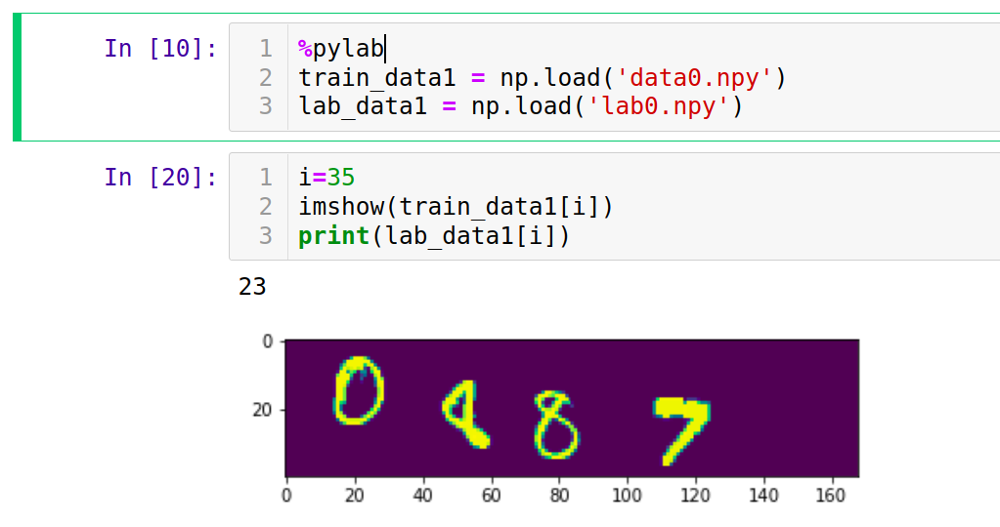

# Problem statement:
Given an image (and its label value) predict the sum of the digits in the image. ​ 

# Details:

- DEADLINE for submission:
    - Preliminary version by 10pm on 08-Jan-2026 (34% weight-age) to perform baseline using standard CNN.
    - Final version due by 10pm on 13-Jan-2025 (66% weight-age): implement your 'own' model and compare to baseline above.
- You can train using any model (FCNN, CNN, RNN etc etc)
- Training data and labels are given. [See [LINK HERE](https://iiitaphyd-my.sharepoint.com/:f:/g/personal/prabhakar_b_iiit_ac_in/IgCDL7qsq7wdSYcwxPQRRRWsAX_i_bJcfxyol72aqDZKN3A?e=kU3usX) for the data; data files are "data*.npy" and label files are "lab*.npy" and an load_data.py illustrates how to access data and labels]
- Additional data can be taken from the internet too to train the model. ​
- Test data will be given later on against which accuracy will be calculated. 
- Training has to be done in Ada.
- The final code should be uploaded to Github Repo.
- Plagiarism will not be entertained. The entire code should be written from scratch.
- Example code illustrating how to load the data, and one example and its label value demonstrated in below screenshot:  
